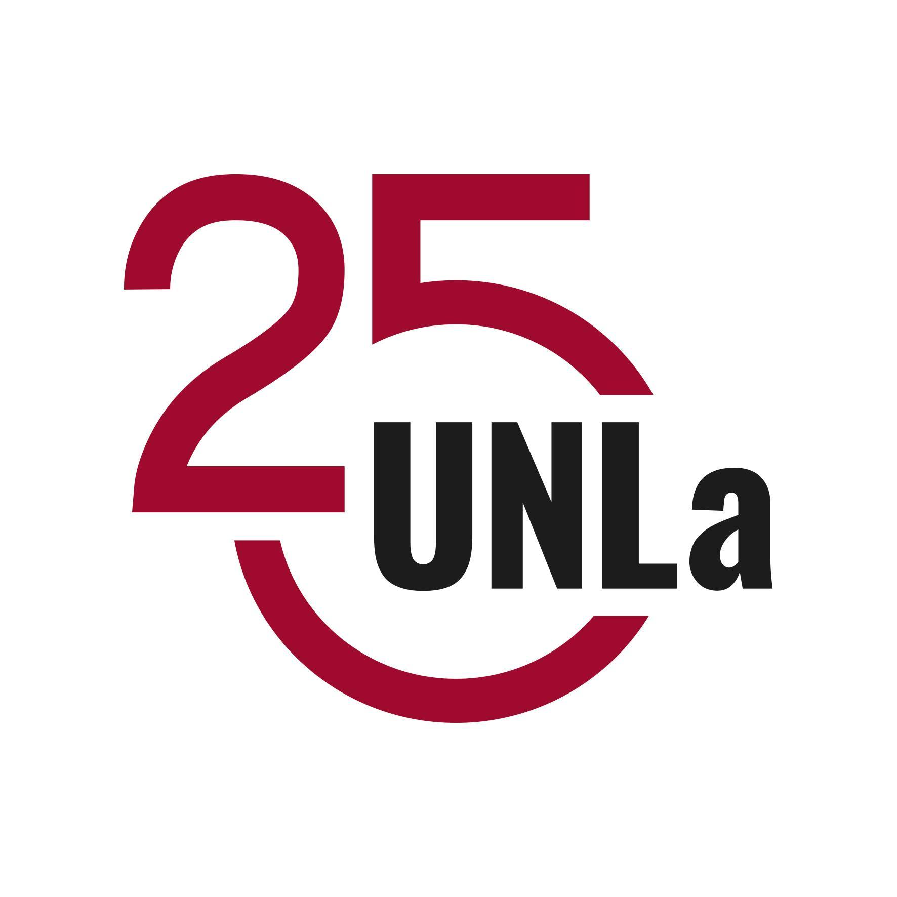

  

<h1 align="center" font-size="3em">Sistema Gestión Aulas UNLa</h1>
  <h3 align="center">Integrantes:</h3>

● Dante Joaquin Mogni
 
● Franco Nordinelli

 <h4 align="center">Grupo 4 - Año 2022</h4>
 
---
   
_Repositorio del proyecto cuatrimestral de la cátedra de Orientación a Objetos 2 de la Universidad Nacional de Lanús, año 2022._
# OO2 - Proyecto Cuatrimestral 2022
**Proyecto:** Sistema integrador (versión web con bases de
datos)

**Paradigma**: Orientado a Objetos.

**BD:** MySQL

**ORM:** Hibernate

**Tecnologías:** Spring Boot

**Resolución:** Implementación de la BD y su conexión,
más una interfaz web para probar el software.

---
### Equipo Docente:

Titular: 
- Lic. María Alejandra Vranić

Ayudantes: 
- Lic. Gustavo Siciliano
